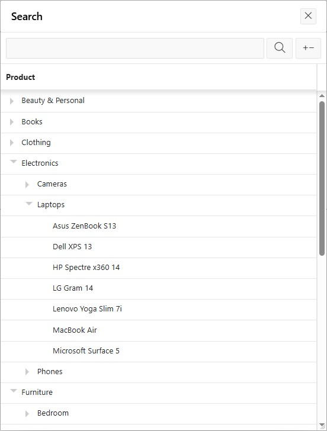

# apex-apply-tree-view
Applies a Tree View to a given Grid. Primarily meant for Popup LOV's.

<p>

</p>

<h4>Steps to configure a Popup LOV Tree View</h4>

The below example configures a Popup LOV to display a Product Tree.

Create an LOV using a hierarchical query, eg:
```
select id, 
       label as product, 
       parent_id, 
       prior label as category, 
       level,
       CONNECT_BY_ISLEAF AS is_leaf        
from demo_product_tree
connect by prior id = parent_id
start with parent_id is null
order siblings by label;
```

In the column mapping, have the 'Default Sort' as 'Use Order By from Query':
<p>
    
</p>

Have all columns selected (so there values will arive in the model):
<p>
    
</p>

Select 'Visible' and 'Searchable' on each Column as applicable.

Add a Popup LOV item to your page and select the above created LOV from the Shared Components.

Supply the configuration. Initialization JavaScript Function:
```
function(options) {     
    options.defaultGridOptions = {
        rowsPerPage: 200, 
        lib4x : {
            applyTreeView: true,
            treeViewOptions: {
                treeColumn: 'PRODUCT',
                parentIdColumn: 'PARENT_ID',
                levelColumn: 'LEVEL',
                isLeafColumn: 'IS_LEAF',
                leafOnlySelection: true,
                initialState: 'collapsed',
                initialExpandToLevel: 2,
                showTooltip: false
            }
        }
    };
    return options;
}
```
The 'treeColumn' is the column to which the tree must be applied. 'initialState' can be 'collapsed' or 'expanded'. In case of 'expanded', the 'initialExpandToLevel' option will be taken into consideration. As a (collapsed) Tree by nature is more dense, it makes sence to configure a 'rowsPerPage' which is a bit higher as to reduce the number of roundtrips to the server.

Last step is to call the Dynamic Action 'LIB4X - Apply Tree View' on page load as to apply the Tree View to all Popup LOV's (and IG's) which do have the defaultGrid(View)Options.lib4x options configured. On the DA itself there are no settings to be configured.
<p>
    
</p>

See an example page [here](https://apex.oracle.com/pls/apex/r/yola/demo/product-tree-popup-lov).

<h4>Configuring an IG Tree View</h4>

SQL hierachical query:
```
select empno, 
       ename, 
       mgr, 
       prior ename as manager, 
       level,
       connect_by_isleaf as is_leaf
from emp
connect by prior empno = mgr
start with mgr is null;
```
IG Region Attributes, Initialization JavaScript Function:
```
function( options ) {
    options.defaultModelOptions = {
        pageSize: 200
    };    
    options.defaultGridViewOptions = {
        lib4x : {
            applyTreeView: true,
            treeViewOptions: {
                treeColumn: 'ENAME',
                parentIdColumn: 'MGR',
                levelColumn: 'LEVEL',
                isLeafColumn: 'IS_LEAF',
                initialState: 'collapsed',
                initialExpandToLevel: 2
            }
        }
    };
    return options;
}
```
<p>
    
</p>

<h4>Plugin Versions</h4>
Version 1.0.0 - build under APEX 24.2

<h2>Credits</h2>
For this plugin, I took as starting point the 'APEX Interactive Grid Treegrid Enhancement APEX Dynamic Action Plugin' by Báldogi Richárd, which in turn is based on the 'TreeGrid jQuery plugin' by Maksym Pomazan.
<br><br>

[APEX Interactive Grid - Treegrid Enhancement](https://github.com/baldogiRichard/apex-treegrid-enhancement-for-ig), which is licensed under the MIT License.<br>
Copyright (c) 2024 Báldogi Richárd<br>
[License](https://github.com/baldogiRichard/apex-treegrid-enhancement-for-ig/blob/main/LICENSE) | [Project](https://github.com/baldogiRichard/apex-treegrid-enhancement-for-ig)

[jQuery treegrid Plugin 0.3.0](https://github.com/maxazan/jquery-treegrid), which is licensed under the MIT License.<br>
Copyright 2013, Pomazan Max<br>
[License](https://github.com/maxazan/jquery-treegrid/blob/master/LICENSE) | [Project](https://github.com/maxazan/jquery-treegrid)
